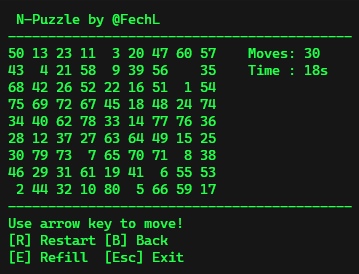

# N-Puzzle Game

N-Puzzle is a classic sliding puzzle game implemented in C++. The game consists of a grid of numbered tiles with one tile missing, allowing adjacent tiles to be moved into the empty space. The objective is to arrange the tiles in numerical order by making sliding moves that use the empty space.

This implementation features adjustable puzzle sizes (from 2x2 up to 9x9), a timer, move counter, and high score tracking. The game uses a console-based interface with keyboard controls for an intuitive gaming experience.



## Installation

### Prerequisites
- C++ compiler (GCC, Visual C++, or any C++11 compatible compiler)
- Windows operating system (for console functions)

### Steps to Install
1. Clone the repository:
   ```
   git clone https://github.com/yourusername/n-puzzle.git
   cd n-puzzle
   ```

2. Compile the source code:
   ```
   g++ -std=c++11 -pthread npuzzle.cpp -o npuzzle
   ```
   
   Or if using Visual Studio:
   - Open the project in Visual Studio
   - Build the solution (Ctrl+Shift+B)

3. Run the executable:
   ```
   ./npuzzle
   ```

## How to Play

1. When you start the game, you'll be prompted to select a puzzle size between 2x2 and 9x9.
2. The game will generate a randomized puzzle of the selected size.
3. Use the arrow keys to move tiles
4. The objective is to arrange the tiles in numerical order from 1 to n² - 1, with the empty space in the bottom-right position.
5. The game tracks the number of moves made and the time elapsed since your first move.
6. If it is impossible to solve, just refill it.

## Controls

| Keys       | Description                       |
|------------|-----------------------------------|
| Arrow keys | Move tiles                        |
| **R**      |  Restart the current puzzle       |
| **E**      |  Generate a new randomized puzzle | 
| **B**      |  Go back to the menu              | 
| **Esc**    |  Exit the game                    | 

## Features

- **Adjustable Difficulty**: Choose puzzle sizes from 2x2 to 9x9
- **Real-time Statistics**: Track moves made and time elapsed during gameplay
- **High Score System**: Save and display the best times for each puzzle size
- **Automatic Game State Verification**: The game automatically detects when the puzzle is solved
- **Multi-threaded Design**: Uses a separate thread for time tracking and display updates
- **Randomized Puzzles**: Each new game generates a unique puzzle configuration
- **User-friendly Interface**: Clean console-based UI with intuitive controls

## Technical Details

- Implemented in C++ with multithreading support
- Uses STL containers for data management
- Thread synchronization with mutexes for safe concurrent operations
- High scores are stored in text files (one per puzzle size) for persistence between game sessions
- Console manipulation for dynamic display updates

## Contributing

Contributions to improve the game are welcome! Please feel free to submit a pull request or open an issue to discuss potential changes or enhancements.

## Credits

Created by [@FechL](https://github.com/FechL)
